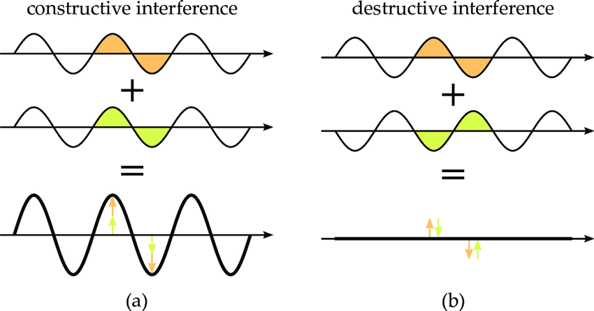

A **quantum phase** is a complex number $e^{i\phi}$ which is one of the factors by which two states can differ. In general, a _global_ phase added to the "mathematical" representation of a state (the [[Bra ket notation|kets]], as the person below calls them) $|\psi>$ is a [[Gauge symmetry|gauge symmetry]] for the "physical" state, meaning that $e^{i\phi}|\psi>$ and $e^{i\theta}|\psi>$ with $\phi\neq\theta$ still describe the same physical system.

Phases only become important when we start adding states with different phases together, because this will lead to [[Interference|interference]] between the two states and to a novel new state.

The easiest way to think about quantum phase is to keep regular ol' wave phase in mind, we are talking about _wave_ functions after all (easy to forget).

If two systems have the same phase, combining them won't lead to interference and everything works as you would expect it to. However, in the case above with $\theta\neq\phi$, the two waves destructively interfere and give new exciting states.

# References

This is a useful link which rather clearly explains why and when a phase matters.

https://physics.stackexchange.com/a/573773
