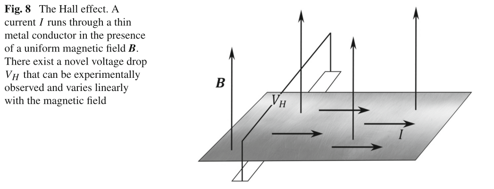
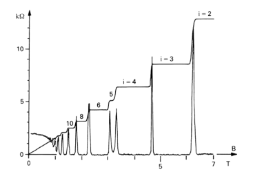
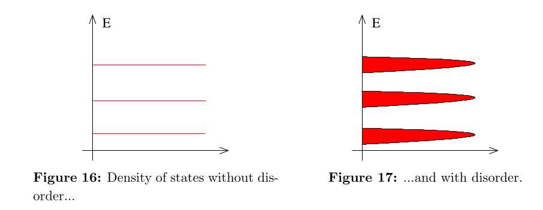

# FQHE Intro to show Ronnie and Guido

Goal: write a ROUGH ass introduction to the fractional quantum hall effect, meaning write down why it is interesting to look at in the context of your general structure.

# Intro

The first phenomenon under study is the so-called fractional quantum Hall effect (FQHE from now on).

Very crudely, the FQHE consists in the observation of peaks and valleys in the transversal and longitudinal resistances in Hall Effect experiments with strong magnetic fields and extremely pure samples, as seen in figure $\ref{fig:fqhe}$.

The FQHE provides an interesting case study, as idealizations are used a lot in order to arrive at the explanation. Crucially, one rather popular explanation of the FQHE necessarily employs an infinitesimal idealization, namely that the configuration space of the electrons involved is 2D. The configuration space of electrons is always 3D, so this is a classic example of an idealization as a fiction used to explain something. However, contra [@Strevens2019a], I argue that this idealization cannot be construed as one which gets rid of a variable irrelevant to the explanation, as this infinite idealization is _crucial_ to the whole explanation: without it there is no explanation.

But, I am getting ahead of myself. The FQHE is not easily summarized in a short paragraph, and the rest of this chapter will be dedicated to providing a rudimentary understanding of the effect and its "causes".

## The [[The classical Hall Effect is just an application of the Lorentz Force|classical hall effect]]

Before we start to describe the Fractional Quantum Hall Effect, we should first understand Quantum Hall effects more generally. To do _that_, a short description of the classical Hall Effect is in order.

The classical Hall effect can be briefly described as the measurement of a voltage _across_ (transversally) a thin conducting plate trough which a current is run in the longitudinal direction and which is subject to a magnetic field perpendicular to both, as in Figure $\ref{fig:che}$

Classically, we can explain the observation of this voltage by the fact that the electrons travelling in the longitudinal direction experience a Lorentz force $\textbf{F} = q\textbf{E} + q\textbf{v} \times \textbf{B}$, which causes them to be redirected to one of the sides of the plate. This leads to a gradient of electrons along the transversal axis, i.e. a voltage difference. Instead of a voltage, the resistance is usually measured.

The classical Hall effect is relatively well understood and, frankly, quite boring.

The classical quantum hall effect happens around .......

# The Quantum Hall Effect(s)

Things start to get more interesting once the strength of the magnetic field is increased quite a bit. We start to observe plateaux at regular intervals in the transversal resistance.

We would of course like to know what explains the appearance of these plateaux.

At even stronger magnetic fields and even cleaner samples, we start to see even more plateaux.

...

Let us first focus our attention on the lower magnetic field range, which gives rise to the socalled _Integer Quantum Hall Effect_. First observed in XXXX by YY, the effect gets its name from the plateaux appearing at integer multiples of the "quantum of resistance".

## Quantum of Resistance

$R_q=e^2\hbar/2\pi$

This is strange, as from the classical quantum hall effect we expect the transversal resistance to vary linearly with the strength of the magnetic field.

## Landau levels

The IQHE comes from the impurities present in the sample: the "pure" energy eigenstates of the system would not lead plateaux. The impurities can be modeled as a random potential. This random potential breaks the degeneracy of the Landau levels and "smooths them out", like

In addition, the disorder causes the energy levels to be split up into _extended_ and _localized_ energy states, like

Only the extended energy levels carry current, the localized ones do not. Furthermore, the extended ones are favored? In any case, as the magnetic field strength increases, so does the energy of the states, so they get pushed up to a new energy level. However, they first have to fill the localized states before they are able to reach a new extended state, and all these localized states do not conduct i.e. do not contribute to the conductivity i.e. do not change the resistance of the material. Tada, you got plateaux.

At this point one may have some questions: these extended states sound like they are about the longitudinal resistance, not the transversal. Furthermore, if the extended states gets less populated and the localized states more populated over the course of a plateaux, why does the resistivity not just shoot up since there are so many less conductive states?

The answer to the latter is that the extended states will end up conducting more, somehow.
