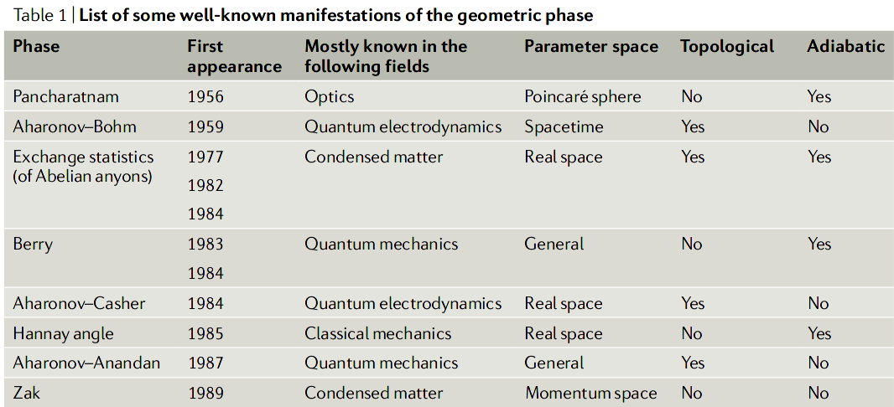

# Geometric Phase

If a quantum system is adiabatically transported from and back to its original _parameters,_ while keeping the system in the same state, it picks up a [[Phase (quantum)]] called the **geometric phase**.

Here are some examples:

Examples are the [[Berry phase]], which is a general phase that a particle picks up whenever it cyclically traverses parameter space; [[the Aharonov Bohm effect (AB)]], which is a rather specific phase that gets picked up by a particle when it cycles around a flux (which was thought not to affect systems physically). and, the most interesting to me, the cyclic traversal (exchange) of identical particles in real space, giving rise to [[anyons]].

Interestingly, the above table indicated that this is a topological phenomenon, which is precisely what I aim to show is _not_ the case.

The main goal of my case study is to relate, quite clearly, the Berry phase to the geometric phase. This is not easy, see this stackoverflow discussion. https://physics.stackexchange.com/questions/383281/when-is-the-berry-phase-only-dependent-on-path-topology

# References

A good paper to look at would be [@Berry1997] for the connection of Berry phase to [[anyons]]
Nevermind, it's not at all about that, it's about deriving fermions and bosons, does not even mention anyons.

# Backlinks #noexport

## No linked reference

## Unlinked references

- \#+TITLE: Berry1997: Indistinguishability for quantum particles: spin, statistics and the geometric phase
- # Indistinguishability for quantum particles: spin, statistics and the geometric phase
- \#+TITLE: Cohen2019: Geometric phase from AharonovBohm to PancharatnamBerry and beyond
- # Geometric phase from AharonovBohm to PancharatnamBerry and beyond
